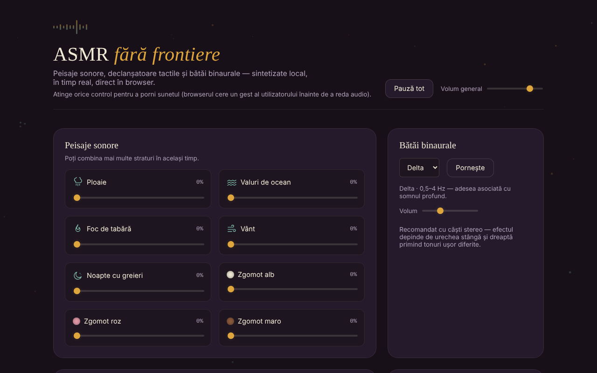

# ASMR fără frontiere

Peisaje sonore, declanșatoare tactile și bătăi binaurale, sintetizate local în browser, într-un singur fișier HTML.

**Live:** https://chiuta.github.io/ASMR/

## Ce este

Un mixer de sunete pentru relaxare, scris în JavaScript simplu. Sunetul nu este redat din fișiere audio: este generat în timp real prin Web Audio API. Aplicația reunește straturi de ambient care se pot combina, sunete scurte declanșate prin atingere, efecte vizuale interactive, bătăi binaurale și un cronometru de adormire.

## Funcții

- **Peisaje sonore** (straturi combinabile, fiecare cu propriul volum): Ploaie, Valuri de ocean, Foc de tabără, Vânt, Noapte cu greieri, Zgomot alb, Zgomot roz, Zgomot maro.
- **Declanșatoare**: Ciocănit lemn, Ciocănit sticlă, Ciocănit masă, Picătură de apă, Foaie întoarsă, Clic tastatură, Foșnet hârtie și Periere (textura continuă cât timp ții apăsat).
- **Efecte vizuale ASMR**: Nisip kinetic, Baloane cu folie, Cerneală în apă, Gheață care crapă, Model simetric, Valuri de lumină; buton **Curăță**.
- **Bătăi binaurale**: benzile Delta, Theta, Alpha și Beta, cu volum separat și buton **Pornește**. Aplicația recomandă căști stereo.
- **Cronometru de adormire**: 15, 30, 45, 60 sau 90 min, sau „Oprit”; afișaj al timpului rămas.
- **Presetări**: șase presetări încorporate (Ploaie de noapte, Furtună pe ocean, Foc de tabără, Concentrare, Adormire, Liniște) și presetări proprii, salvate cu nume (maximum 24 de caractere).
- Buton **Pauză tot / Redă tot** și **Volum general**.
- Tastele Enter și Spațiu activează declanșatoarele când acestea au focus.

## Manual de utilizare

1. Deschide pagina și atinge orice control: browserul cere un gest al utilizatorului înainte de a reda audio.
2. În „Peisaje sonore”, ridică glisorul unuia sau mai multor straturi; reglează „Volum general”.
3. În „Declanșatoare”, atinge un buton pentru un sunet scurt; la „Periere” ține apăsat cât vrei textura.
4. În „Efecte vizuale ASMR”, alege un efect și interacționează cu el; „Curăță” îl resetează.
5. În „Bătăi binaurale”, alege banda (Delta, Theta, Alpha sau Beta), ajustează volumul și apasă **Pornește**.
6. Pentru adormire, alege durata în „Cronometru de adormire”; sunetul se oprește la expirarea timpului. „Oprit” anulează cronometrul.
7. În „Presetări”, apasă o presetare încorporată sau scrie un nume (Enter sau **Salvează**) pentru a-ți salva combinația curentă de straturi și banda binaurală activă.
8. **Pauză tot** oprește temporar toate sunetele; același buton le reia.

## Avertisment

Conținut informativ și de relaxare; nu înlocuiește sfatul medical. Descrierile benzilor binaurale (Delta, Theta, Alpha, Beta) sunt asocieri populare; dovezile științifice privind efectul lor asupra somnului, concentrării sau stării de spirit sunt limitate, iar aplicația nu este un dispozitiv medical și nu tratează nicio afecțiune. Ține volumul la un nivel confortabil; dacă ai epilepsie, tinnitus sau altă afecțiune, cere sfatul unui medic înainte de utilizare îndelungată.

## Confidențialitate și rețea

- **Stocare locală (localStorage):** o singură cheie, `asmr_ff_presets`, cu presetările tale salvate (nume, niveluri ale straturilor, bandă binaurală). Dacă browserul blochează stocarea, presetările rămân doar în memorie până la reîncărcare.
- **Rețea:** în cod nu există cereri de rețea (`fetch`), scripturi, fonturi sau imagini încărcate din exterior și nici linkuri externe. Nu există analytics.

## Rulare locală / offline

Descarcă `index.html` și deschide-l în browser; nu are nevoie de internet. Este nevoie de un browser cu suport Web Audio API și JavaScript activat.

## Licență

Licența nu este încă declarată explicit în acest repository; vezi nota din aplicație.

Aplicația însăși conține doar mențiunea: „Fișierul e al tău. 100% local — fără cont, fără telemetrie, fără server.”

## Autor

Alexio — Alexandru-Ionuț Chiuță. Contact: alexio@trom.tf

## English summary

ASMR fără frontiere is a single-file ASMR sound mixer: layered soundscapes (rain, ocean, fire, wind, crickets, white/pink/brown noise), touch triggers, interactive visual effects, binaural beats (Delta/Theta/Alpha/Beta) and a sleep timer, all synthesised live with the Web Audio API. It makes no network requests; only user-saved presets are kept in localStorage. UI is in Romanian. License not yet declared explicitly.

Audit: 2026-10-10 — verificat cod (fără cereri de rețea), accesibilitate (axe) și funcționare; adăugat avertisment.
